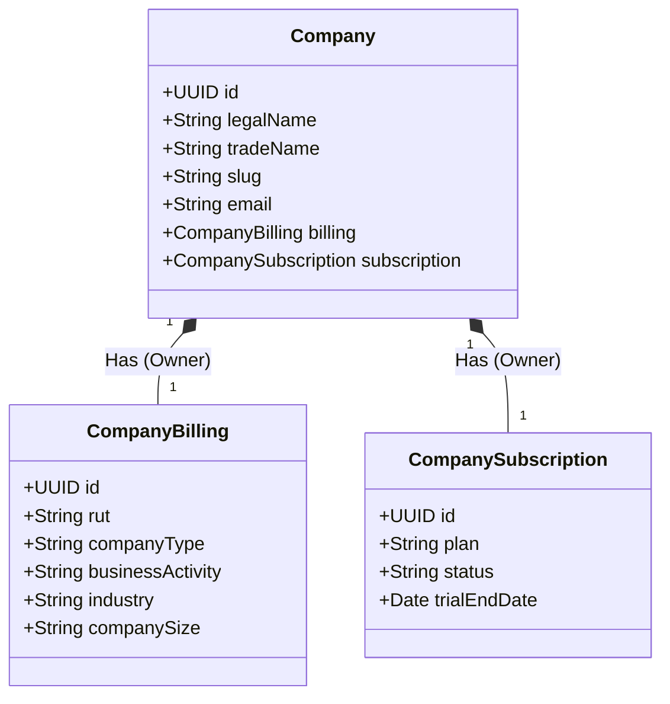

# Módulo de Compañías (Companies)

El módulo `CompaniesModule` es el núcleo de la arquitectura multi-tenant de la plataforma. Gestiona la identidad corporativa, información legal/tributaria (Billing) y el sistema de suscripción SaaS (Subscription).

## Arquitectura

El módulo implementa un diseño de **Aggregate Root**, donde `Company` es la entidad raíz y gestiona el ciclo de vida de sus componentes satélite.



## Estructura de Endpoints

La API se ha modularizado en 3 controladores especializados bajo el prefijo `/companies`:

### 1. Core Controller (`/companies`)
Gestiona el ciclo de vida principal de la entidad.

| Método | Ruta | Descripción | Rol Requerido |
|--------|------|-------------|---------------|
| `POST` | `/companies` | Crea empresa, billing y subscripción atómicamente | SUPER_ADMIN |
| `GET` | `/companies` | Lista empresas paginadas | SUPER_ADMIN |
| `GET` | `/companies/:id` | Obtiene detalle completo | AUTH |
| `GET` | `/companies/rut/:rut` | Busca por RUT chileno | AUTH |

### 2. Billing Controller (`/companies/:id/billing`)
Gestiona datos legales y tributarios (SII).

| Método | Ruta | Descripción |
|--------|------|-------------|
| `GET` | `/companies/:id/billing` | Obtiene datos de facturación |
| `PATCH` | `/companies/:id/billing` | Actualiza dirección, giro, rep. legal |

### 3. Subscription Controller (`/companies/:id/subscription`)
Gestiona lógica de negocio SaaS.

| Método | Ruta | Descripción |
|--------|------|-------------|
| `GET` | `/companies/:id/subscription` | Estado actual del plan |
| `POST` | `/companies/:id/subscription/upgrade` | Cambiar plan (Free -> Pro) |
| `POST` | `/companies/:id/subscription/cancel` | Cancelar suscripción |

## Ejemplo de Uso (Create Company)

**Header:** `Authorization: Bearer <TOKEN>`

**POST /companies**

```json
{
  "legalName": "Empresa de Prueba SpA",
  "tradeName": "PruebaCorp",
  "email": "contacto@pruebacorp.cl",
  "phone": "+56912345678",
  "billing": {
    "rut": "76.123.456-7",
    "companyType": "SpA",
    "businessActivity": "Desarrollo de Software",
    "fiscalAddress": "Av. Siempre Viva 742",
    "commune": "Providencia",
    "region": "RM",
    "legalRepName": "Homero Simpson",
    "legalRepRut": "10.000.000-1",
    "legalRepPosition": "CEO",
    "industry": "technology",
    "companySize": "small"
  },
  "subscription": {
    "plan": "professional",
    "billingFrequency": "monthly"
  }
}
```

## Notas Técnicas
*   **Encodings:** Los Enums de base de datos (`industry`, `company_size`) utilizan valores en inglés/minúsculas (`technology`, `small`) para asegurar compatibilidad y evitar errores de encoding.
*   **Transacciones:** La creación de empresa ocurre dentro de una transacción de base de datos. Si falla el billing o la suscripción, no se crea la empresa.
